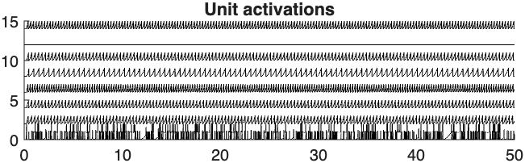
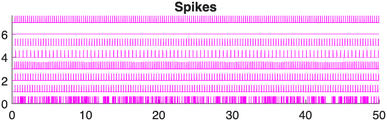
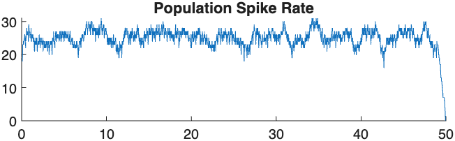
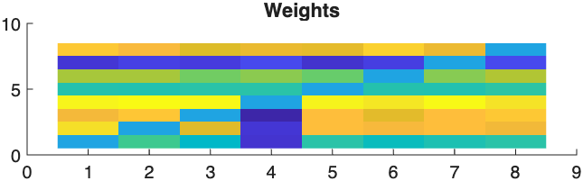

# Recurrent Spiking Neural Network Simulation (LIF Model)

## Summary

This project implements a **recurrent spiking neural network simulator** from scratch using the **Leaky Integrate-and-Fire (LIF)** neuron model in MATLAB.

The goal of the project is to explore how **synaptic transmission dynamics influence population-level neural activity**, particularly whether more biologically realistic synaptic interactions can produce **smoother and slower population firing rates** compared to simple instantaneous coupling.

The simulator models:

- stochastic external input using **Poisson-like spike trains**
- **recurrent neuron-to-neuron interactions**
- **double-exponential synaptic transmission dynamics**
- population-level activity statistics and visualization

The project investigates how **local neuron interactions lead to emergent global dynamics**, such as synchronization or smoother population activity.

---

# Project Overview

Many computational neuroscience models assume that **population neural activity evolves on a slower timescale than individual neurons**.  
However, this assumption is often built into models rather than directly tested.

This project builds a **recurrent spiking neural network** to examine whether realistic synaptic dynamics can naturally produce this effect.

Specifically, the simulation explores:

- how **synaptic rise and decay dynamics** affect network stability  
- how **recurrent connectivity** shapes global activity patterns  
- how network parameters influence **population time constants**

The implementation avoids existing neural simulation frameworks and instead directly translates the **LIF differential equations** into a discrete numerical simulation written in MATLAB.

---

# Model Structure

The simulated system consists of:

External Poisson input
↓
LIF neurons
↓
Recurrent synaptic connections
↓
Population activity statistics

Key components of the model include:

- stochastic external input
- recurrent connectivity matrix
- LIF membrane dynamics
- double exponential synaptic transmission
- noise-driven variability

Only the first neuron receives direct external input, and activity propagates through the network via weighted synaptic connections.

---

# Simulation Components

## External Input

External input is delivered only to **unit 1**.

The input is generated as a **Poisson-like spike train** using a thresholded random process.

This input directly affects the membrane voltage of the first neuron.

---

## LIF Neuron Dynamics

Each neuron follows standard **leaky integrate-and-fire dynamics**:

- membrane voltage decays with time constant **tau**
- when voltage crosses threshold **V = 1**, a spike is emitted
- voltage is reset to **0** after a spike
- voltages are constrained to remain non-negative

---

## Synaptic Transmission

Instead of instantaneous spike coupling, synaptic transmission is modeled using a **double exponential response function**:

s = (W / K) * exp(-(t - last_spike)/tau_decay) .* (1 - exp(-(t - last_spike)/tau_rise))

where:

- **tau_rise** controls how quickly synaptic current increases
- **tau_decay** controls how quickly it decays
- **last_spike** stores the most recent spike time for each neuron
- **K** normalizes the peak synaptic response

This formulation produces **more realistic synaptic dynamics** and helps reduce pathological network synchronization.

---

## Noise

Gaussian noise scaled by `sqrt(dt)` is added to the voltage update equation to introduce stochastic variability.

---

# Results

The simulation generates several visualizations of network dynamics.

Example outputs include:

---

---

Computed using a sliding time window.

---

### Connection Weight Matrix

---

# Code Structure

This project contains two main MATLAB functions.

### `testingvarb.m`

Defines the **network configuration**.

This includes:

- number of neurons (`numUnits`)
- membrane time constants (`tau`)
- connection weight matrix (`W`)

The weight matrix is manually constructed using values drawn from normal distributions with different means.

Some rows primarily produce **excitatory effects**, while one column contains **negative weights** to approximate inhibition.

Self-connections are removed by setting the **diagonal of the matrix to zero**.

After defining these parameters, the script calls:

LIF_population5(numUnits, W, tau)

---

### `LIF_population5.m`

Runs the **main population-level LIF simulation**.

The function implements:

- external stochastic input
- LIF membrane voltage dynamics
- double exponential synaptic transmission
- noise-driven variability
- population-level activity analysis

It also automatically generates figures showing network dynamics.

---

# How to Run the Project

Place the following files in the same MATLAB working directory:

LIF_population5.m
testingvarb.m

Open MATLAB and set the current folder to this directory.

Run:

testingvarb

from the command window or by pressing **Run** in the editor.

The simulation will run and automatically generate all figures.

---

# Modifying the Simulation

To explore different network behaviors, modify parameters inside `testingvarb.m`, such as:

- the number of units
- the membrane time constants `tau`
- the structure and scale of the weight matrix `W`

No other changes are required to run the simulation.

---

# Project Motivation

This project explores how **local neuron interactions give rise to emergent population dynamics** in recurrent neural systems.

It provides a simple simulation framework for studying:

- synchronization phenomena
- population time constants
- stability in recurrent neural systems
- biologically inspired temporal computation
